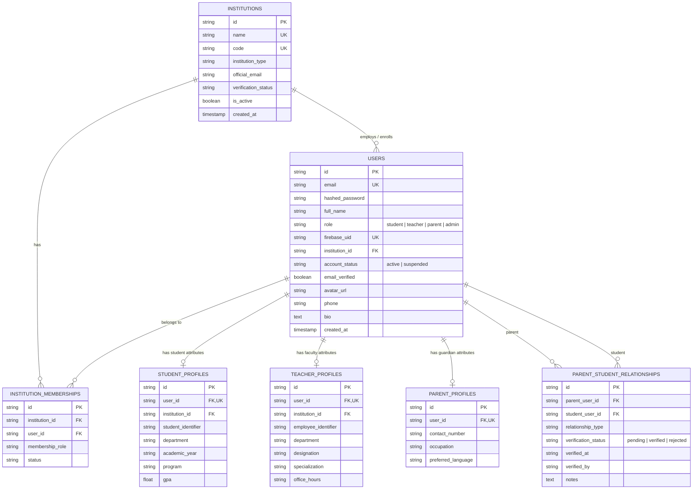

# EduVerse AI – Relational Database Design (Phase 1 & 2)

```mermaid
erDiagram
    INSTITUTIONS ||--o{ USERS : "employs / enrolls"
    INSTITUTIONS ||--o{ INSTITUTION_MEMBERSHIPS : "has"
    USERS ||--o{ INSTITUTION_MEMBERSHIPS : "belongs to"
    USERS ||--o| STUDENT_PROFILES : "has student attributes"
    USERS ||--o| TEACHER_PROFILES : "has faculty attributes"
    USERS ||--o| PARENT_PROFILES : "has guardian attributes"
    USERS ||--o{ PARENT_STUDENT_RELATIONSHIPS : "parent"
    USERS ||--o{ PARENT_STUDENT_RELATIONSHIPS : "student"

    INSTITUTIONS {
        string id PK
        string name UK
        string code UK
        string institution_type
        string official_email
        string verification_status
        boolean is_active
        timestamp created_at
    }

    USERS {
        string id PK
        string email UK
        string hashed_password
        string full_name
        string role "student | teacher | parent | admin"
        string firebase_uid UK
        string institution_id FK
        string account_status "active | suspended"
        boolean email_verified
        string avatar_url
        string phone
        text bio
        timestamp created_at
    }

    STUDENT_PROFILES {
        string id PK
        string user_id FK, UK
        string institution_id FK
        string student_identifier
        string department
        string academic_year
        string program
        float gpa
    }

    TEACHER_PROFILES {
        string id PK
        string user_id FK, UK
        string institution_id FK
        string employee_identifier
        string department
        string designation
        string specialization
        string office_hours
    }

    PARENT_PROFILES {
        string id PK
        string user_id FK, UK
        string contact_number
        string occupation
        string preferred_language
    }

    PARENT_STUDENT_RELATIONSHIPS {
        string id PK
        string parent_user_id FK
        string student_user_id FK
        string relationship_type
        string verification_status "pending | verified | rejected"
        string verified_at
        string verified_by
        text notes
    }

    INSTITUTION_MEMBERSHIPS {
        string id PK
        string institution_id FK
        string user_id FK
        string membership_role
        string status
    }
```
